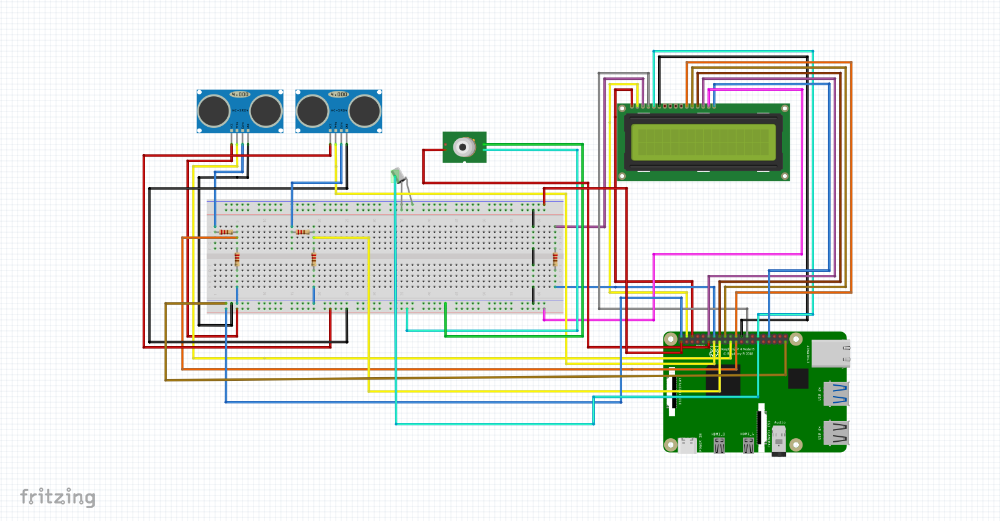
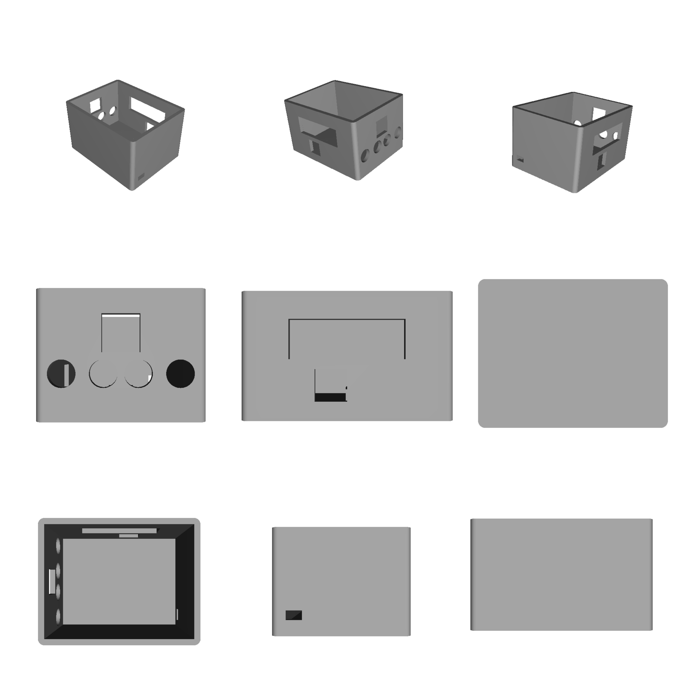
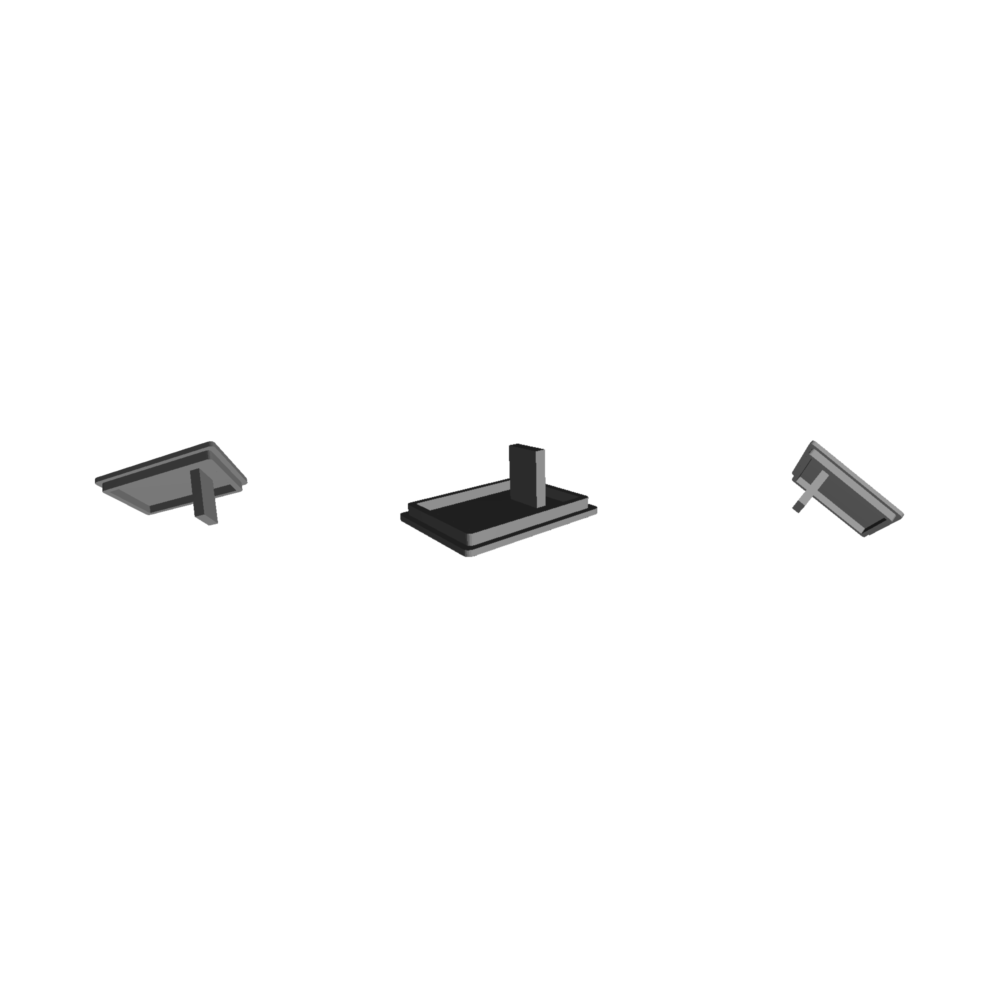
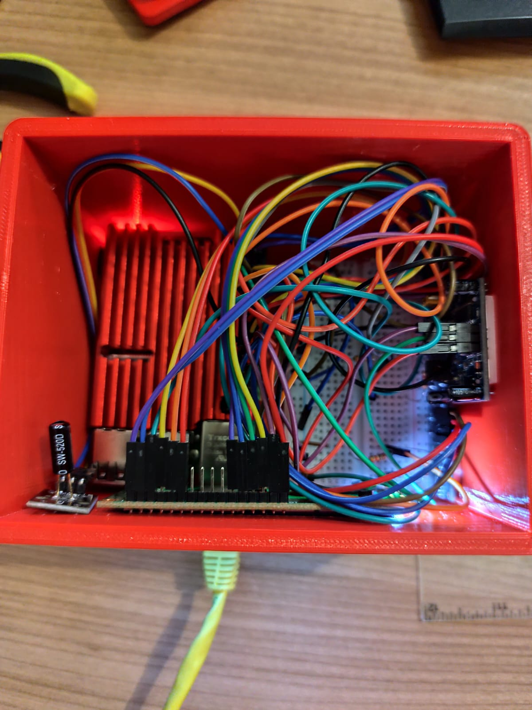
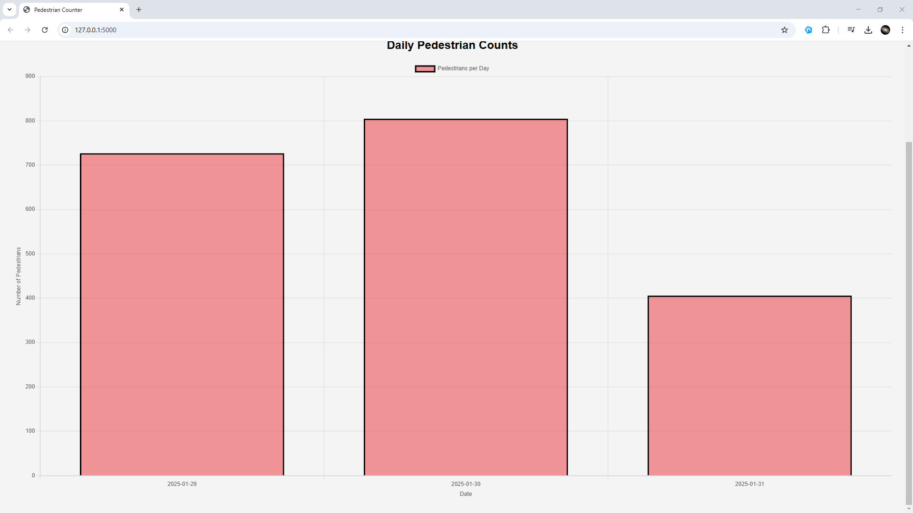

# People-counter
# People-counter
---
# Week 3: Sensor and Actuator Demonstration
During this week, I conducted tests for the individual sensors and actuators needed for the project. For the distance sensors, I evaluated their accuracy in detecting objects at varying ranges and ensured they can handle the required real-world conditions. The tilt sensor was tested for sensitivity to small angular changes, and the PIR sensor was validated for its ability to reliably detect motion. Each sensor was connected to the Raspberry Pi, and initial readings were logged to verify communication and data integrity. This testing phase ensured that all components were functioning as expected before integration into the larger system.

## Components Used

-Raspberry Pi

-HC-SR501 PIR Sensor (Motion detection)

-HC-SR04 Ultrasonic Sensors (Distance measurement, two used for accuracy)

-KY-002 Shock Sensor (Detects vibrations or movement)

-QAPASS Display (Displays real-time pedestrian count)

-Jumper wires & Breadboard

# Week 4: Schematic drawing
Schematic drawing was created to provide a clear visual representation of how all components are connected. This includes wiring for the HC-SR501 PIR sensor, two HC-SR04 ultrasonic sensors, KY-002 shock sensor module, and the display module. The schematic helps ensure proper connections and makes troubleshooting easier if any issues arise.


# Week 5: Preparing Components for Housing
This week focused on preparing the sensors and actuators for installation into the project’s housing. I designed and 3D-printed mounts and supports to securely hold each sensor in place within the enclosure. Protective casings were applied to ensure durability. The housing design was reviewed to accommodate all components.


# Week 6: Finalizing the Housing
Continuing from the previous week, I assembled the sensors, actuators, and other hardware into the prepared housing. This required precise alignment to ensure optimal functionality, particularly for the distance sensors, which needed unobstructed views of their measurement zones.



# Week 7: Integrating Components with the Raspberry Pi
This week marked the integration of all sensors and actuators with the Raspberry Pi. I set up GPIO pin configurations and connected the hardware to the Raspberry Pi using a custom breakout board. I developed a Python script to read sensor data and tested the full system for data acquisition accuracy. Debugging was done to resolve any issues with signal interference or communication errors.

**Code**:
```c
SENSORS = {
    "Left": {"TRIG": 27, "ECHO": 22},  # Left-side ultrasonic sensor
    "Right": {"TRIG": 10, "ECHO": 9},  # Right-side ultrasonic sensor
}

PIR_SENSOR = 17  # Motion sensor (detects heat)
SHOCK_SENSOR = 5  # Detects movement or tilt

# LCD Setup
lcd = CharLCD(cols=16, rows=2, pin_rs=7, pin_e=8, pins_data=[25, 24, 23, 18], numbering_mode=GPIO.BCM)

GPIO.setmode(GPIO.BCM)
GPIO.setup(PIR_SENSOR, GPIO.IN)
GPIO.setup(SHOCK_SENSOR, GPIO.IN)

# Setup GPIO for ultrasonic sensors
for sensor in SENSORS.values():
    GPIO.setup(sensor["TRIG"], GPIO.OUT)
    GPIO.setup(sensor["ECHO"], GPIO.IN)
```
# Week 8: Assembling the Complete System
The final assembly stage involved installing the Raspberry Pi into the housing alongside the sensors and actuators. Unfortunately, cable management turned out to be a disaster—I hadn't thought it through beforehand, which led to a messy and unorganized setup. This made the process more challenging and required extra effort to prevent tangling and potential damage during operation. Despite this setback, I managed to test the entire system to ensure all components worked together. Once everything was in place, the housing was securely sealed, and the device was powered on to verify its full functionality in a simulated environment.



# Week 9: Demonstrating Model Functionality
With the complete system assembled, I performed a full demonstration of the pedestrian counter. This included testing all sensors under various conditions and logging the results to confirm the device’s accuracy and reliability. While the web application was not yet implemented, data was displayed directly on a connected monitor or logged locally for analysis. Any minor adjustments were made to optimize performance based on the demonstration findings.

**Sensor test source code:** [Tests](Software/People-counter/tests)

# Week 10: Database Development for the Web Application
The focus this week was on designing and implementing a database to store sensor readings and event logs. I created the database schema to include tables for summary and pedestrians. The database was integrated with the Raspberry Pi using SQLite, enabling efficient storage and retrieval of information.
```c
CREATE TABLE summary (
    id INTEGER PRIMARY KEY,
    total_count INTEGER NOT NULL
);

CREATE TABLE pedestrians (
    id INTEGER PRIMARY KEY AUTOINCREMENT,
    timestamp TEXT NOT NULL,
    direction TEXT NOT NULL
);

```
# Week 11: Web Application Development
This week, I focused on developing a web application that serves as an interface for monitoring and managing pedestrian counting data. The backend was built using Flask to handle API requests, while SQLite was used as the database to store sensor readings.

On the frontend, I utilized HTML, CSS, and JavaScript to create a user-friendly dashboard that displays real-time data from the Raspberry Pi. The web application allows users to:



-View current pedestrian counts

-Access historical data

I implemented various API endpoints for functionalities such as fetching sensor data, adding new sensor readings, and managing devices. To ensure the system's integrity, I incorporated security measures including authentication and data validation to protect against unauthorized access and incorrect data inputs.

To test the web application, I deployed it locally and verified that sensor data was correctly stored and displayed. Additionally, I performed debugging and optimization to enhance performance and ensure smooth operation.
